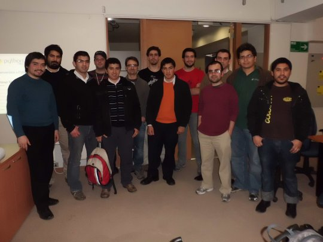
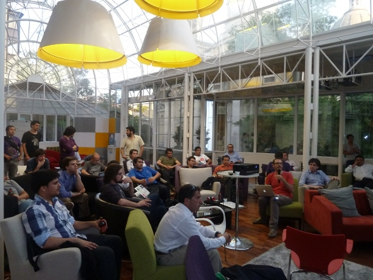
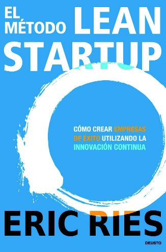

# Python en Chile

---

# Pedro Burón

## Desarrollador Python

## Fundador de Python Chile

## Emprendedor

- [http://witoi.com](http://witoi.com)
- [https://github.com/pedroburon](https://github.com/pedroburon)

---

# ¿Por qué python?

---

# Porque es Open Source y Software Libre

---

# Python Chile

---

# Lo qué estamos haciendo

# [https://groups.google.com/forum/#!forum/pythonchile](https://groups.google.com/forum/#!forum/pythonchile)
# [http://www.meetup.com/python-chile/](http://www.meetup.com/python-chile/)

---

---

---

# ¿Para qué Python Chile?

- Comunidad de profesionales

- Comunidad de Hackers

- Visibilidad de Python en la industria

- Networking

- ¡Oportunidades de trabajo!

---

# *¿Preguntas?*

---

# Python en la empresa

---

# Python en la empresa

## Mitos

- Lenguaje de juguete

- Fácil de escribir mal

- Lento

- Pocos developers

- Poca infraestructura

---

# Mitos

## Lenguaje de juguete

    !bash
    $ find /usr/ -name *.py | wc -l
    $ 12264
    $ find /usr/ -name *.c | wc -l
    $ 450
    $ find /usr/ -name *.java | wc -l
    $ 79
    $ find /usr/ -name *.class | wc -l
    $ 2

## Fácil de escribir mal

    !python
    if True:
        print 'es verdad!'
    else:
        print 'mentiroso!'
    opensource = good if gpl else not_so_bad
    map(lambda x: x*x, [0, 1, 2, 3, 4, 5])
    [x * x for x in range(0, 10)] # { x*x para x en [0,10[ } 

- Indentación
- TDD
- Agilidad

---

# Mitos

## Lento

- Numpy
- Alma
- Nasa
- Google

## Poca infraestructura

- Cualquier infraestructura
- Linux, linux, linux
- Zope
- Jython
- IronPython

---

# Mitos

## Pocos developers

---

# *¿Preguntas?*

---

# Python en el emprendimiento

---

---

# Lean Startup

## Y Customer Development

---

# No conocemos al cliente

---

# Eliminar desperdicios

----

# Cross OS

## Muchos posibles clientes
## Necesidades distintas

---

# Prototipado rápido

## Aplicaciones funcionando
## Fallar rápido

---

# Open Source y <del>librerías</del> bibliotecas

---

# *¿Preguntas?*

---

.qr: 450|http://pedroburon.info/pythonflisol2012

- [github.com/pedroburon/pythonflisol2012](https://github.com/pedroburon/pythonflisol2012)

---

# Presentación realizada con landslide

- [https://github.com/adamzap/landslide](https://github.com/adamzap/landslide)

Para instalar

    !sh
    $ pip install landslide

